### summary of sql practice  :
- Relational databases are a type of database management system that organizes data into tables with predefined relationships between them. SQL (Structured Query Language) is a programming language used to manage and manipulate data in relational databases.

- SQL provides a standardized way to interact with relational databases. It offers various commands, such as SELECT, INSERT, UPDATE, and DELETE, which allow users to query and modify data. SQL statements can be used to create, modify, and delete tables, as well as to perform advanced operations like joining tables, filtering data, and aggregating information

- In summary, relational databases organize data into tables with predefined relationships, and SQL is used to interact with and manipulate data in these databases. Together, they provide a powerful and reliable solution for managing and querying structured data.

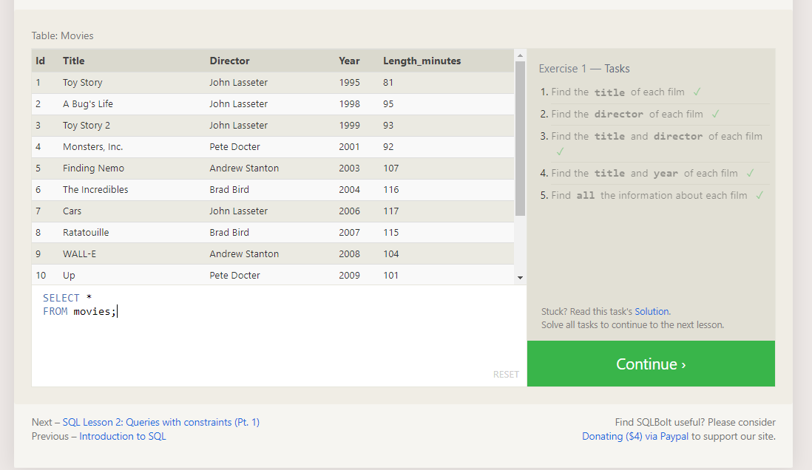
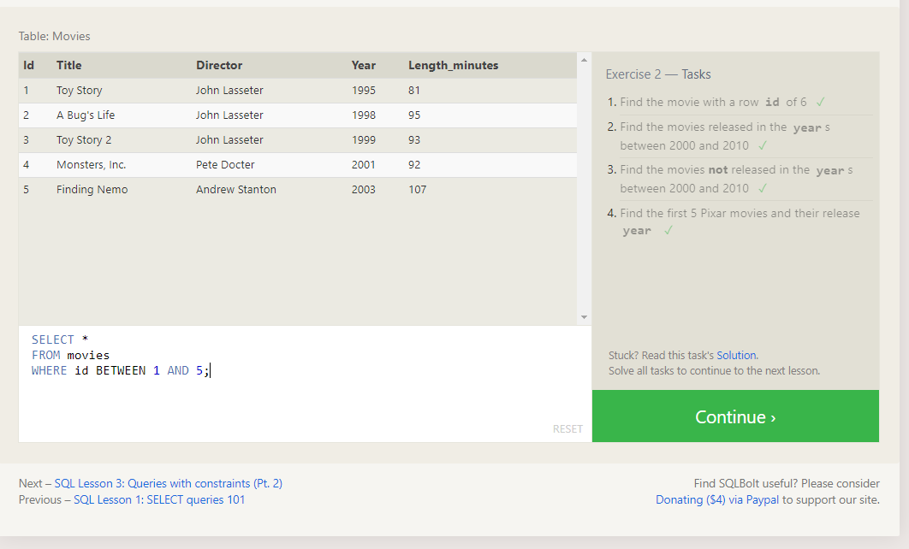
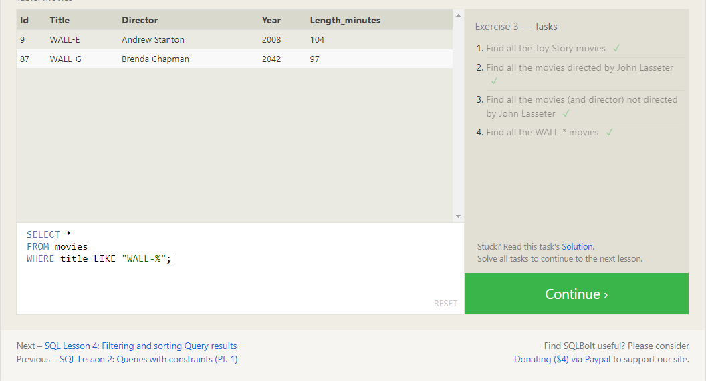
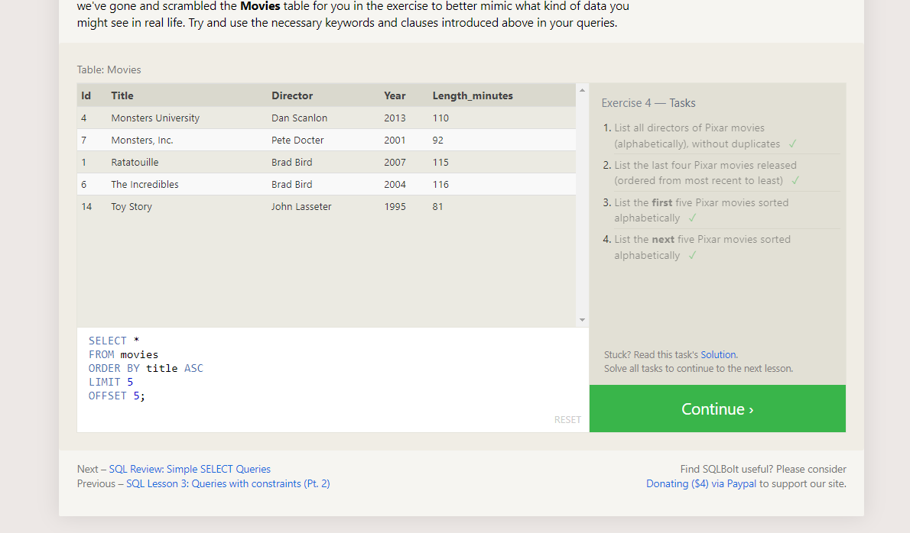
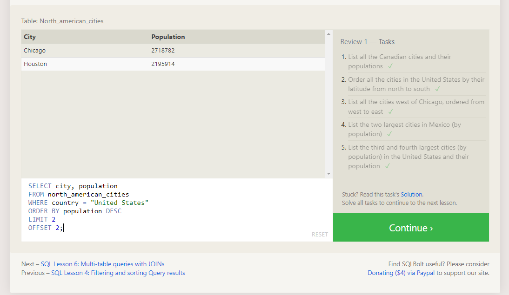
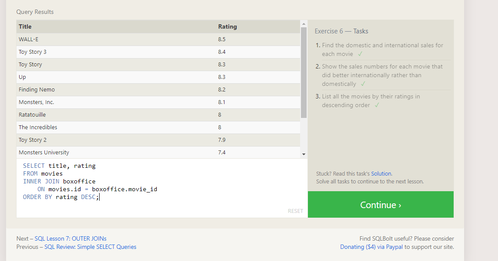
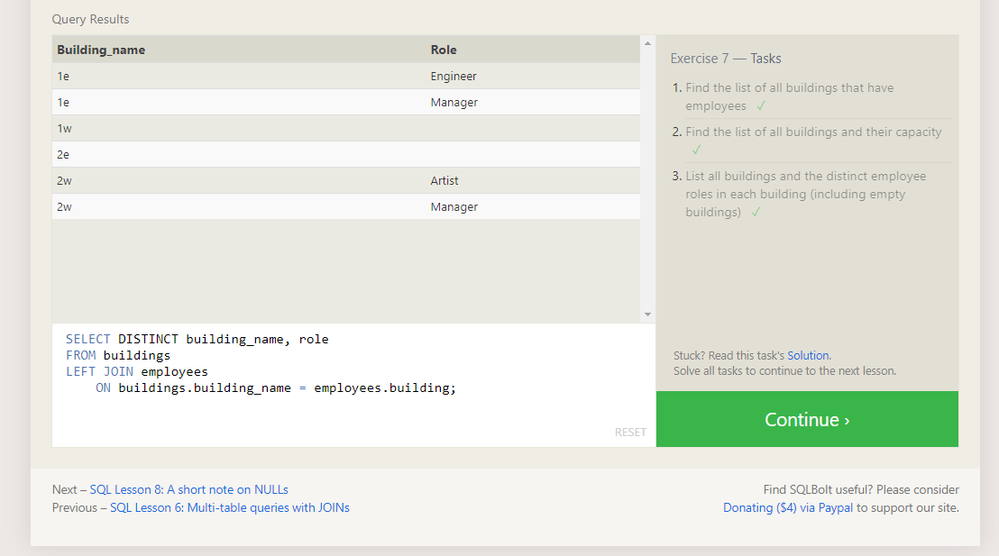
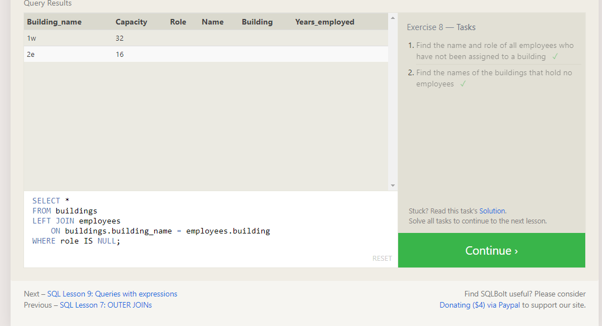
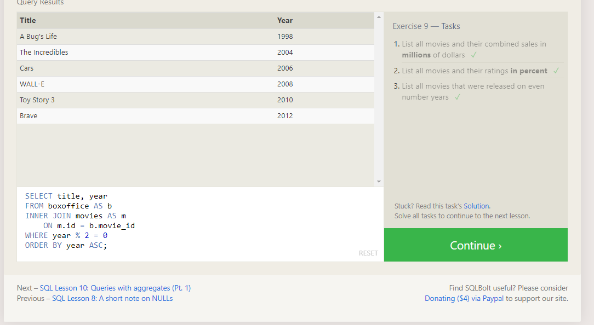
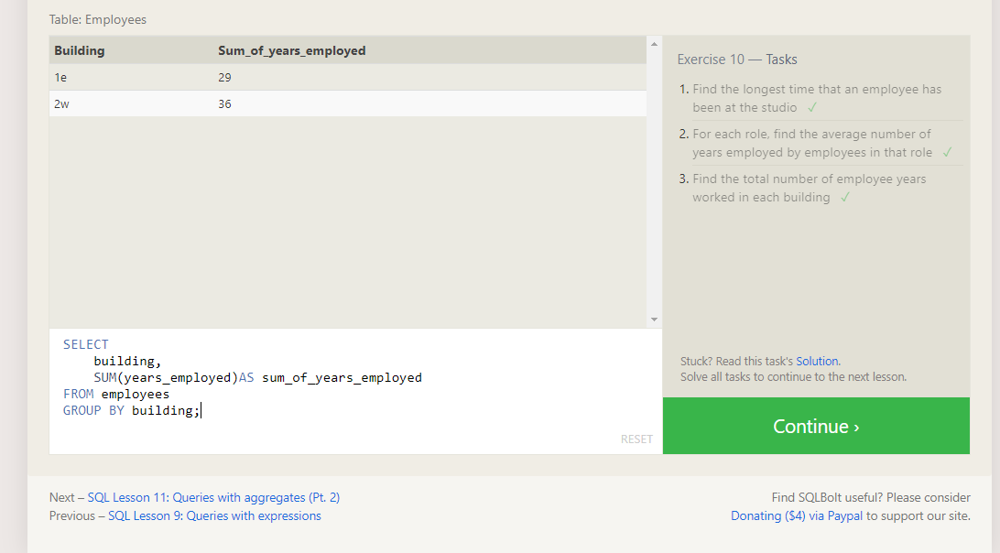
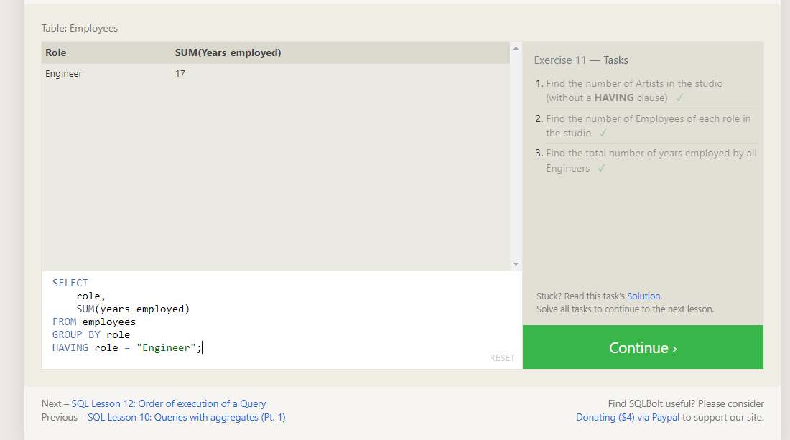
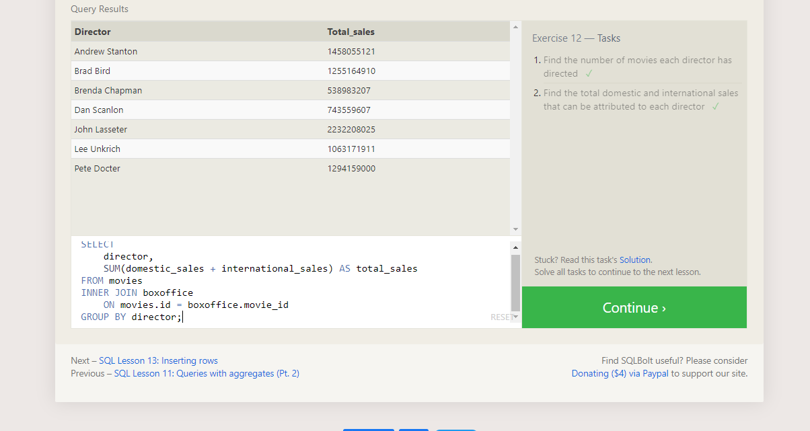
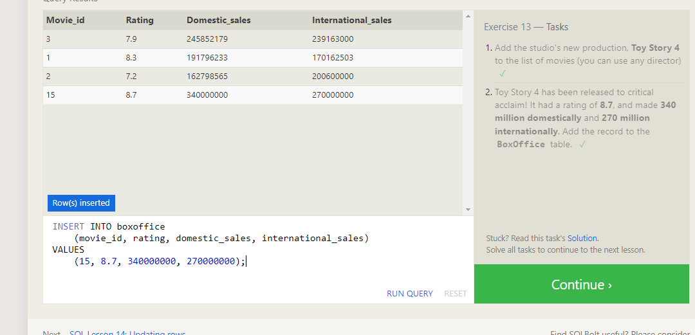
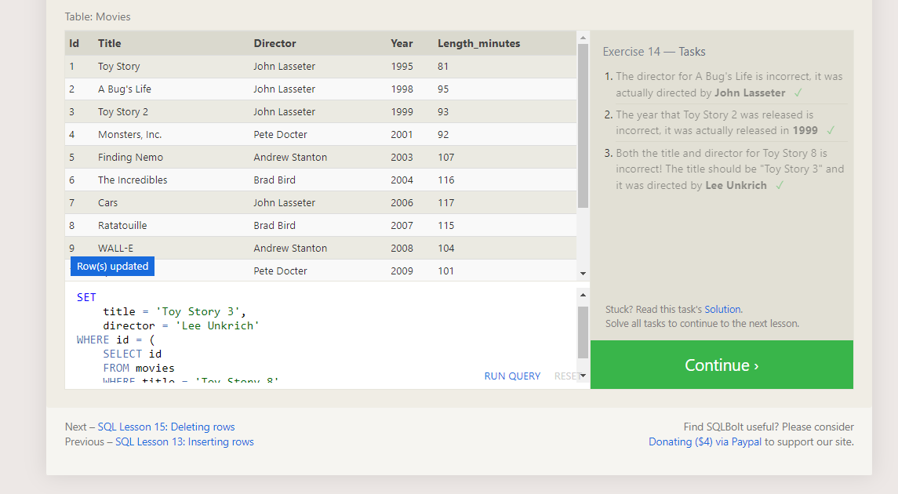
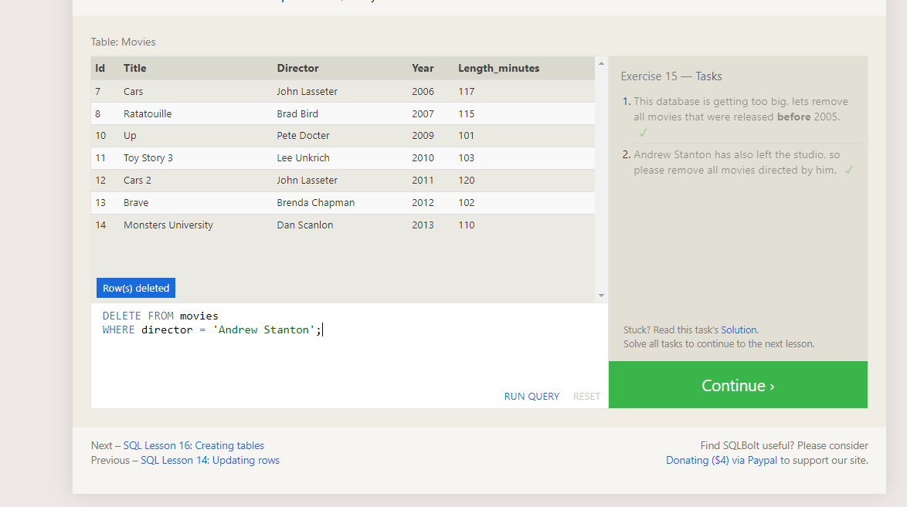
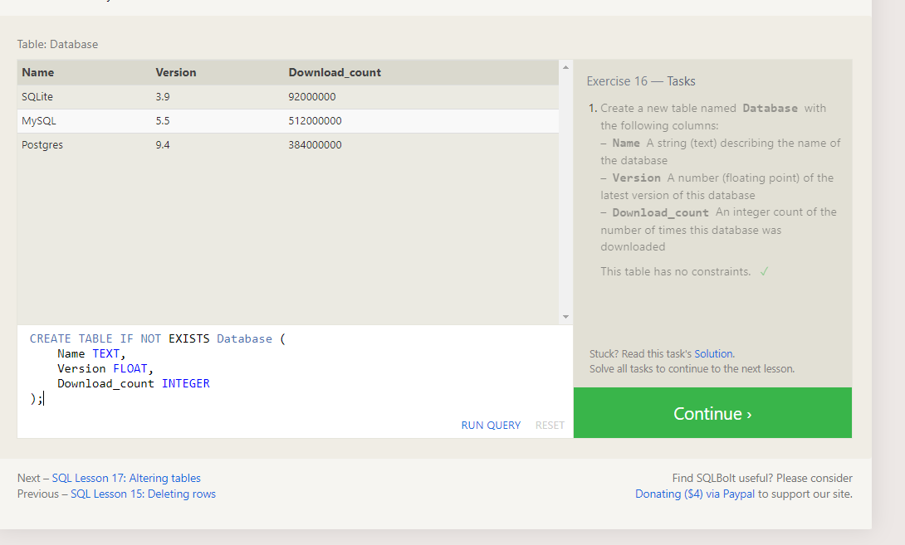
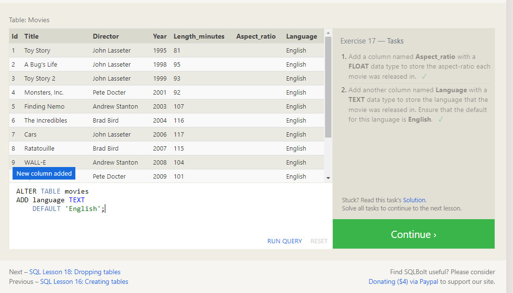
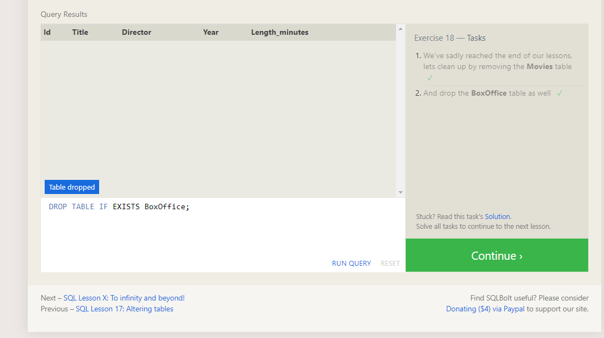
